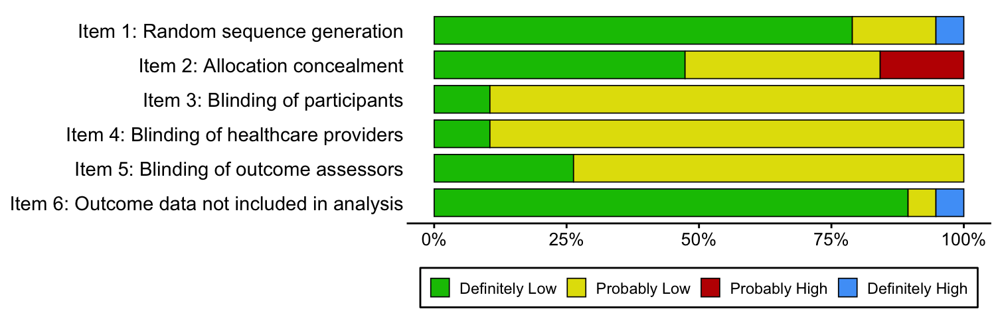
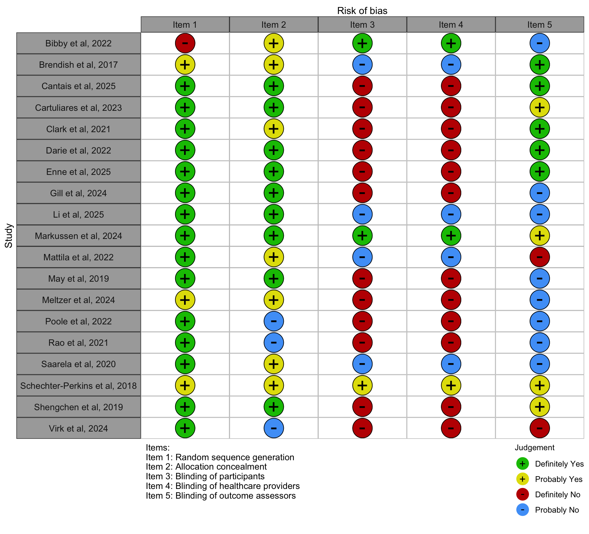
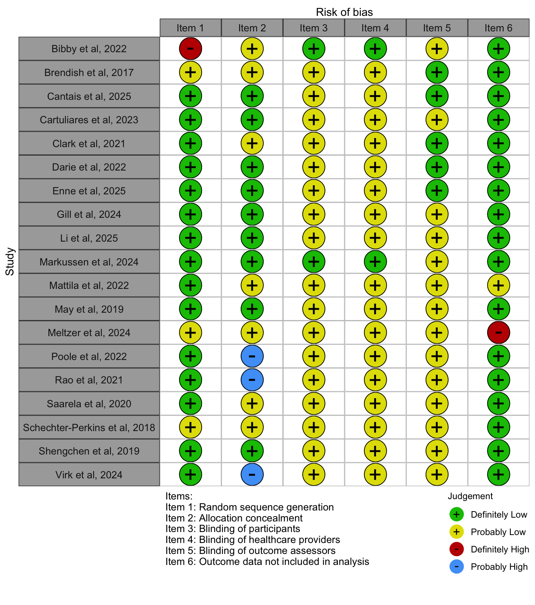

# RobustVis

ROBUST-RCT is the latest tool for evaluating the risk of bias in randomized controlled trials, published in *BMJ*. The `RobustVis` package can visualize ROBUST-RCT assessments in a Cochrane style.

## Installation

You can install the development version of `RobustVis` directly from GitHub using `devtools`:

```R
install.packages("devtools")
devtools::install_github("tcmchen7410-bot/RobustVis")
library(RobustVis)
```

## Create plots 

The package contains two plotting functions:

1. `rob_bar`
A function to convert risk-of-bias assessment data for Step 1 or Step 2 into tidy data and plot a summary stacked barplot matching the standard Cochrane style with a boxed legend and custom labels.

```R
#For step 1
rob_bar(data_step1, step = 1)
```


```R
#For step 2
rob_bar(data_step1, step = 2)
```



2. `rob_traffic_light`
Draw a robvis-style traffic-light grid for step 1 or step 2 assessments. The first column of 'data' contains study labels; the remaining columns map by position to Item 1–5 (`step = 1`) or Item 1–6 (`step = 2`).

```R
#For step 1
rob_traffic_light(data = data_step1, step = 1)
```


```R
#For step 2
rob_traffic_light(data = data_step2, step = 2)
```


For more detailed information about the function, please refer to the `help page`.


## Author Information

* **Guang Chen** (Author, Creator) — `tcm_chen7410@163.com`


## License

This project is open source and available under the MIT License.

## Acknowledgments

We referenced the `robvis` package in the development of the `RobustVis` package.
